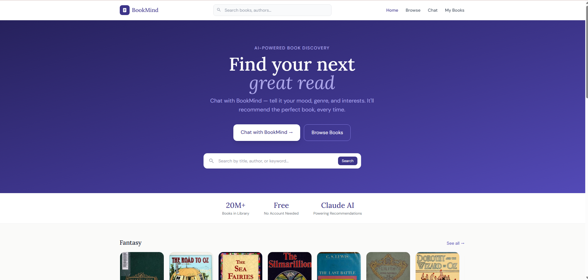
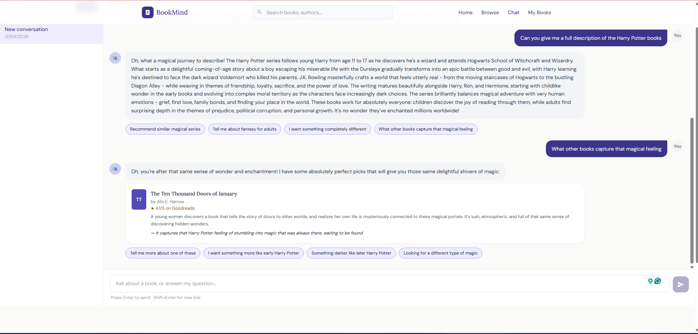

#  BookMind — AI-Powered Book Discovery Platform

BookMind is a modern AI-driven book recommendation system that combines conversational intelligence with real-time data retrieval to help users discover their next great read.

It leverages **Claude AI** for natural interactions and **Open Library APIs** for scalable book data, wrapped in a clean, responsive React application.

---

##  Preview

---

##  Architecture

Frontend (React + Vite)  
        ↓  
AI Layer (Claude API)  
        ↓  
Data Layer (Open Library API)  

---

